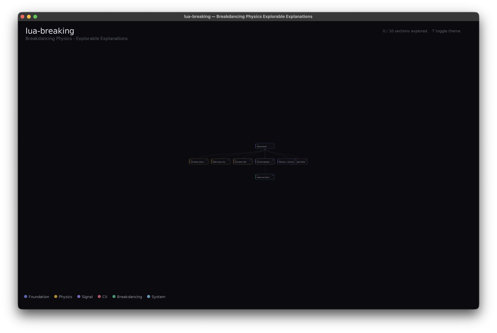

<p align="center">
  <h1 align="center">lua-breaking</h1>
  <p align="center">
    <em>Interactive explorable explanations for breakdancing physics</em>
  </p>
  <p align="center">
    <a href="#sections"></a>
    <a href="https://github.com/stussysenik/bboy-analytics"></a>
    
    
  </p>
</p>

---

A Love2D desktop app that turns computer vision research into hands-on simulations. Every concept from the [`bboy-analytics`](https://github.com/stussysenik/bboy-analytics) pipeline — joint kinematics, force fields, musicality scoring, pose validation — becomes something you can drag, scrub, and tweak.

Built to teach. Synced to research.

<p align="center">
  
  <br/>
  <sub>Graph navigation — light mode</sub>
</p>

<p align="center">
  
  <br/>
  <sub>Graph navigation — dark mode</sub>
</p>

## Quick Start

```bash
# macOS
brew install love

# Run
cd lua-breaking
love .
```

Click a node to enter a section. `ESC` to return. `T` to toggle light/dark mode.

## Sections

12 interactive sections built, 12 more planned. Each section is a self-contained explorable explanation with educational text, interactive parameters, and formula overlays.

### Foundation

| ID | Section | Status |
|----|---------|--------|
| 1.1 | **The Joint Model** — Interactive SMPL skeleton, 24 joints, click to inspect hierarchy | Done |
| 1.2 | Coordinate Systems — World/camera/screen transforms | Planned |
| 1.3 | FK/IK Basics — Forward and inverse kinematics | Planned |

### Physics

| ID | Section | Status |
|----|---------|--------|
| 2.1 | **Joint Velocity Vectors** — Per-joint speed arrows with timeline scrubber | Done |
| 2.2 | **Kinetic Energy Flow** — Energy as heat through the skeleton, body-part bar chart | Done |
| 2.3 | Energy Acceleration — dK/dt with beat overlay | Planned |
| 2.4 | Angular Momentum — Conservation demo for powermoves | Planned |
| 2.5 | **Force Vector Field** — Electric-field-style contact force visualization | Done |
| 2.6 | **Center of Mass & Stability** — COM tracking with support polygon | Done |
| 2.7 | Compactness — Body shape morphing and spin speed | Planned |
| 2.8 | Balance & Stability — Box2D freeze physics | Planned |

### Signal Processing

| ID | Section | Status |
|----|---------|--------|
| 3.1 | **Beat Detection** — Waveform, energy envelope, onset function, threshold | Done |
| 3.2 | **8D Audio Signature** — Radar chart of 8 psychoacoustic dimensions | Done |
| 3.3 | **Musicality (mu)** — Cross-correlation between movement and audio | Done |
| 3.4 | Cycle Detection — Autocorrelation for powermove periodicity | Planned |

### Computer Vision

| ID | Section | Status |
|----|---------|--------|
| 4.1 | 3D Reconstruction — Depth ambiguity in monocular recovery | Planned |
| 4.2 | Why Inversions Break — Training distribution gaps | Planned |
| 4.3 | **Validation Gate Pipeline** — Animated frames through 5 quality gates | Done |
| 4.4 | BRACE Ground Truth — PCK scoring explained | Planned |

### Breakdancing Domain

| ID | Section | Status |
|----|---------|--------|
| 5.1 | Move Taxonomy — Toprock/footwork/powermove/freeze tree | Planned |
| 5.2 | **Powermove Physics** — Windmill, flare, headspin simulations | Done |
| 5.3 | Freeze Balance — COM + support polygon for freeze poses | Planned |
| 5.4 | Musicality in Practice — Full audio + motion + score integration | Planned |

## Research Context

This is the visual companion to [`bboy-analytics`](https://github.com/stussysenik/bboy-analytics) — a quantitative computer vision pipeline for analyzing breakdancing battles. The research uses:

| Model | Paper | Role |
|-------|-------|------|
| **JOSH** | ICLR 2026 | 3D human reconstruction from monocular video |
| **GVHMR** | SIGGRAPH Asia 2024 | World-grounded motion recovery |
| **BeatNet+** | — | Real-time beat/downbeat detection |
| **BRACE** | ECCV 2022 | Red Bull BC One breakdancing dataset |
| **CoTracker3** | ICLR 2025 | Dense point tracking through occlusions |

The hardest problem: **no model handles inverted breakdancing**. Headspins, windmills, and flares produce out-of-distribution poses that break every reconstruction baseline. lua-breaking makes this visible and interactive.

## Sync with bboy-analytics

lua-breaking stays synchronized with [`bboy-analytics`](https://github.com/stussysenik/bboy-analytics) through two mechanisms:

### Data Bridge

Export real motion data from the research pipeline:

```bash
python tools/export_motion.py \
  --joints path/to/joints.npy \
  --output data/bcone_seq4.json \
  --model josh --fps 29.97
```

Sections with data bridge support load real JOSH/GVHMR joint reconstructions instead of simulated data.

### Concept Manifest

Tag commits in bboy-analytics with `[concept: name]` to auto-generate visualization stubs:

```bash
# In bboy-analytics
git commit -m "feat: add cyclic score metric [concept: cycle_detection]"

# Then sync
python lua-breaking/tools/sync_manifest.py \
  --repo-dir . --manifest-dir ../lua-breaking
```

## The 8D Audio Signature

One of the key innovations in [`bboy-analytics`](https://github.com/stussysenik/bboy-analytics) is characterizing music with 8 psychoacoustic dimensions:

| # | Dimension | What it measures | Why it matters for bboy |
|---|-----------|-----------------|------------------------|
| 1 | Bass Energy | Low-freq power (20-250Hz) | Footwork timing, groove foundation |
| 2 | Percussive Strength | Transient-to-sustained ratio | Beat hits, freeze timing |
| 3 | Vocal Presence | Mid-freq formant energy | Call-and-response, phrase structure |
| 4 | Beat Stability | Inter-beat interval consistency | Predictability for anticipatory movement |
| 5 | Spectral Flux | Rate of spectral change | Musical "activity" to react to |
| 6 | Rhythm Complexity | Syncopation/polyrhythm | Off-beat musicality challenges |
| 7 | Harmonic Richness | Overtone density | Emotional quality, movement style |
| 8 | Dynamic Range | Loudness variance | Build-up/release, dynamic freezes |

These feed into the **musicality score**: `mu = max_tau corr(M(t), H(t-tau))`, where `H(t)` is the weighted combination of all 8 dimensions.

## Musicality Scoring

The core metric: **how well does a dancer's movement sync to the music?**

```
mu = max_tau corr(M(t), H(t - tau))

M(t) = movement energy (sum of 3D joint velocity magnitudes)
H(t) = audio heat (weighted 8D signature)
tau  = time lag (dancers hit slightly ahead or behind the beat)
mu   = peak Pearson correlation across all lags
```

| Grade | Threshold | Meaning |
|-------|-----------|---------|
| **S** | >= 0.90 | Exceptional musicality |
| **A** | >= 0.75 | Strong musicality |
| **B** | >= 0.55 | Good musicality |
| **C** | >= 0.35 | Some musical awareness |
| **D** | < 0.35 | Weak correlation |

Section 3.3 makes this tangible — drag the tau slider and watch the correlation change in real-time.

## Architecture

```
main.lua                    Entry point + input routing
shell/
  graph.lua                 Node graph navigation (zoom, pan, click)
  theme.lua                 Light/dark mode, layer colors, spacing tokens
lib/
  skeleton.lua              SMPL 24-joint topology + drawing
  vector.lua                2D/3D vector math (no-garbage variants)
  physics.lua               Kinetic energy, COM, angular momentum, stability
  signal.lua                Cross-correlation, autocorrelation, windowing
  draw.lua                  Arrows, vector fields, grids, formulas, badges
  widgets.lua               Sliders, buttons (immediate-mode)
  data_loader.lua           JSON motion data loader with frame interpolation
  json.lua                  rxi/json.lua (MIT) safe parser
  timeline.lua              Playback scrubber
sections/
  X_Y_name/init.lua         Self-contained section modules
tools/
  export_motion.py          joints.npy -> JSON for Love2D
  sync_manifest.py          Git hook: detect new concepts, generate stubs
```

Each section follows a standard interface: `load()`, `update(dt)`, `draw()`, mouse/key callbacks, `unload()`. The graph shell loads all sections from `sections/*/init.lua` and arranges them as clickable nodes.

## Controls

| Key | Action |
|-----|--------|
| Click | Enter section / interact |
| ESC | Return to graph |
| T | Toggle light/dark mode |
| Scroll | Zoom graph |
| Drag | Pan graph / drag elements |
| Space | Play/pause (timeline sections) |
| R | Reset (section-specific) |
| 1-5 | Tab switch (multi-tab sections) |

## Tech Stack

- **[Love2D](https://love2d.org) 11.4** — Desktop app framework with Box2D physics
- **Lua 5.1** — via LuaJIT in Love2D
- **Python 3.10+** — Data export and sync tooling
- **[rxi/json.lua](https://github.com/rxi/json.lua)** — Safe JSON parsing (MIT)

## Related

- [`bboy-analytics`](https://github.com/stussysenik/bboy-analytics) — The research pipeline this visualizes
- [BRACE Dataset](https://github.com/dmoltisanti/brace) — Red Bull BC One breakdancing annotations
- [Love2D](https://love2d.org) — The runtime

## License

MIT
